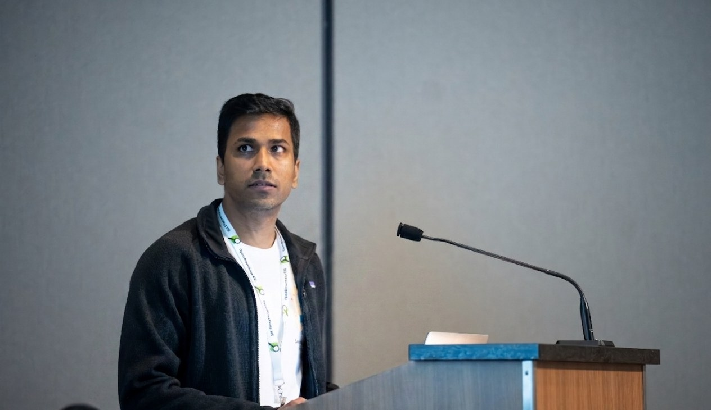
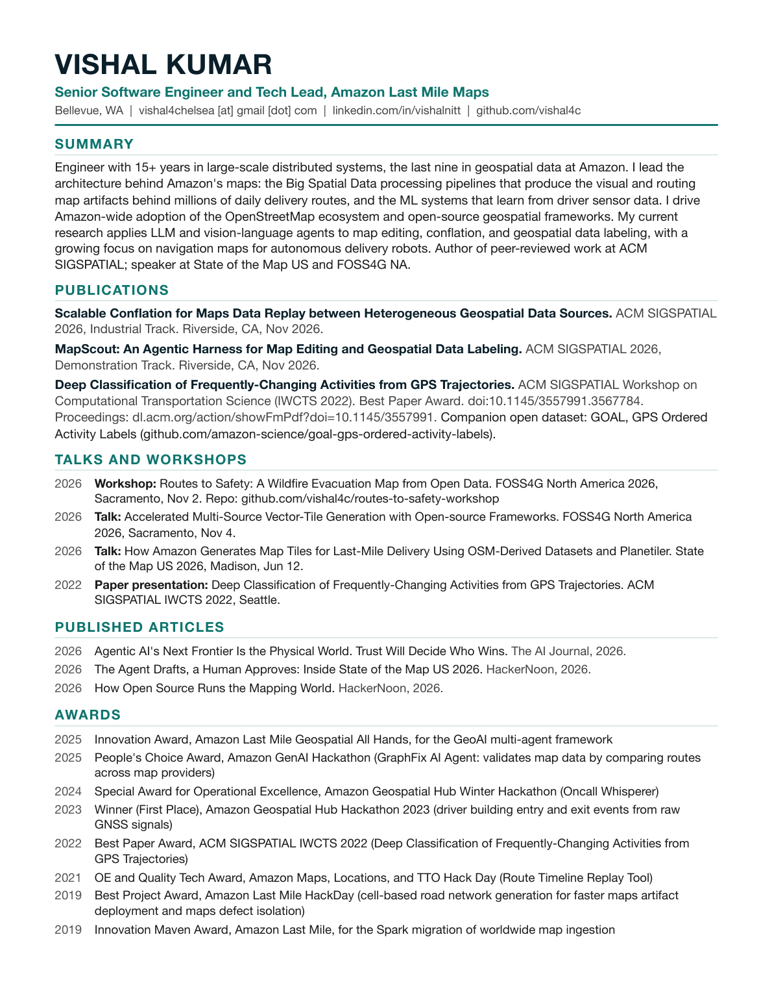
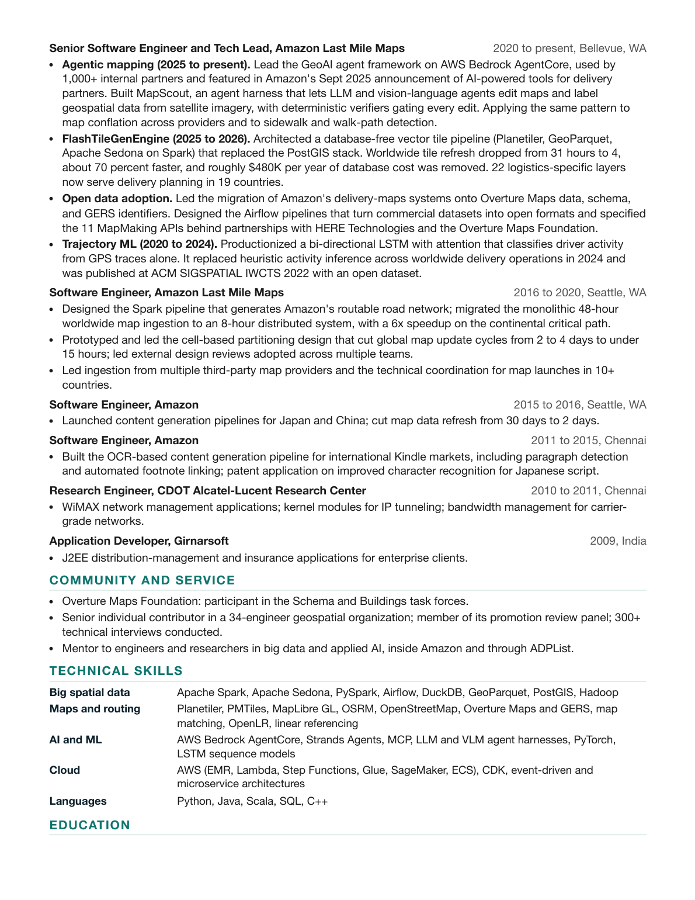

 

# Vishal Kumar

### Research interests: Big Spatial Data pipelines, Map Rendering and Routing at planet scale, and Spatial Reasoning Agents for Agentic Mapping.

  
  
  
  
  
  

I am a Senior Software Engineer and Tech Lead at Amazon Last Mile Maps in Bellevue, WA. I lead the architecture behind Amazon's maps: the Big Spatial Data processing pipelines that produce the visual and routing map artifacts behind millions of daily delivery routes, and the ML systems that learn from driver sensor data. I drive Amazon-wide adoption of the OpenStreetMap ecosystem and open-source geospatial frameworks. My current research applies LLM and vision-language agents to map editing, conflation, and geospatial data labeling, with a growing focus on navigation maps for autonomous delivery robots.

## Research interests

| Area | What I work on |
| --- | --- |
| Agentic AI for geospatial tasks | Agent harnesses for map editing, tool-grounded reasoning over satellite and street-view imagery, verifier-in-the-loop labeling, multi-agent critic loops, and a glass box UI for debugging agent reasoning and tool-use patterns. |
| Big spatial data systems | Planet-scale ETL on Spark and Apache Sedona, database-free vector tile generation (Planetiler, GeoParquet, PMTiles), incremental map updates. |
| Map conflation and migration | Cross-provider road correspondence, geometric edit replay, transferring private edits between OpenStreetMap and Overture base maps. |
| Trajectory and sensor ML | Driver-activity classification from raw GPS traces, ground-truth aggregation from fleet telemetry, GNSS-based building entry detection. |
| Intelligent transportation | Routing networks for last-mile and pedestrian delivery, navigation for autonomous delivery robots, entrance and access-point extraction, sidewalk and walk-path detection. |

## Publications

- **Scalable Conflation for Maps Data Replay between Heterogeneous Geospatial Data Sources.**
  ACM SIGSPATIAL 2026, Industrial Track. Riverside, CA, Nov 2026.
  [Accepted papers](https://sigspatial2026.sigspatial.org/industry-accepted/)
- **MapScout: An Agentic Harness for Map Editing and Geospatial Data Labeling.**
  ACM SIGSPATIAL 2026, Demonstration Track. Riverside, CA, Nov 2026.
  [Accepted demos](https://sigspatial2026.sigspatial.org/demo-accepted/)

- **Deep Classification of Frequently-Changing Activities from GPS Trajectories.**
  ACM SIGSPATIAL Workshop on Computational Transportation Science (IWCTS 2022).
  **Best Paper Award, IWCTS 2022.** [DOI 10.1145/3557991.3567784](https://doi.org/10.1145/3557991.3567784) · [IWCTS 2022 proceedings front matter](https://dl.acm.org/action/showFmPdf?doi=10.1145%2F3557991)
  The model replaced heuristic driver-activity inference across Amazon's worldwide delivery operations. Companion open dataset: [GOAL: GPS Ordered Activity Labels](https://github.com/amazon-science/goal-gps-ordered-activity-labels).

## Talks and workshops

| When | Venue | Title |
| --- | --- | --- |
| Nov 2, 2026 | FOSS4G North America 2026, Sacramento | Workshop: [Routes to Safety: A Wildfire Evacuation Map from Open Data](https://talks.osgeo.org/foss4g-na-2026/talk/NYKALL/). [Workshop GitHub repo](https://github.com/vishal4c/routes-to-safety-workshop) |
| Nov 4, 2026 | FOSS4G North America 2026, Sacramento | Session details: [Accelerated Multi-Source Vector-Tile Generation with Open-source Frameworks](https://talks.osgeo.org/foss4g-na-2026/talk/USHLU9/) |
| Jun 12, 2026 | State of the Map US 2026, Madison | [How Amazon Generates Map Tiles for Last-Mile Delivery Using OSM-Derived Datasets and Planetiler](https://openstreetmap.us/events/state-of-the-map-us/2026/how-amazon-generates-map-tiles/) ([video](https://www.youtube.com/watch?v=N96IdetD6CE)) |
| Oct 2022 | ACM SIGSPATIAL IWCTS 2022, Seattle | [Deep Classification of Frequently-Changing Activities from GPS Trajectories](https://dl.acm.org/action/showFmPdf?doi=10.1145%2F3557991) |

## Showcased System Architecture

- **MapScout.** Agent harness in which LLM and vision-language agents edit maps and label geospatial data from satellite and street-level imagery, with deterministic verifiers gating every edit. Powers sidewalk, walk-path, and entrance detection for pedestrian and robotic last-mile delivery, the map layer behind Amazon's doorstep-delivery robotics push ([CNBC, Mar 2026](https://www.cnbc.com/2026/03/19/amazon-acquires-startup-rivr-to-test-robots-for-doorstep-delivery.html)). Demo paper accepted at [ACM SIGSPATIAL 2026](https://sigspatial2026.sigspatial.org/demo-accepted/).
- **FlashTileGenEngine.** Database-free vector tile pipeline (Planetiler, GeoParquet, Apache Sedona on Spark) that replaced a PostGIS stack. Worldwide tile refresh dropped from 31 hours to 4, 22 logistics-specific layers, tiles served across 19 countries. Presented at [State of the Map US 2026](https://openstreetmap.us/events/state-of-the-map-us/2026/how-amazon-generates-map-tiles/).
- **Routable road network generation.** Big-data pipeline (2019) that builds Amazon's last-mile road graph; later Spark migration took world-wide map ingestion from a 48-hour monolith to an 8-hour distributed job. This network powers turn-by-turn navigation in the Amazon Flex driver app ([Amazon Flex blog](https://flex.amazon.com/blog/navigating-to-and-from-delivery-stops-with-ease/)).
- **GeoAI agent framework.** Multi-agent system on AWS Bedrock AgentCore for geospatial analysis, used by 1,000+ internal partners. Featured in Amazon's announcement of AI-powered tools for delivery partners ([About Amazon, Sept 2025](https://www.aboutamazon.com/news/transportation/amazon-delivery-service-partner-investment-safety-ai-tools)).
- **Driver activity classifier.** Bi-directional LSTM with attention that infers activity from GPS traces alone, in production worldwide since 2024. Open dataset released with the paper: [GOAL, GPS Ordered Activity Labels](https://github.com/amazon-science/goal-gps-ordered-activity-labels).

## Awards

| Year | Award | Work recognized |
| --- | --- | --- |
| 2025 | Innovation Award, Amazon Last Mile Geospatial All Hands | GeoAI multi-agent framework on AWS Bedrock AgentCore, used by 1,000+ internal partners |
| 2025 | People's Choice Award, Amazon GenAI Hackathon | GraphFix AI Agent, which validates map data by comparing routes across map providers and flagging road network defects |
| 2024 | Special Award for Operational Excellence, Amazon Geospatial Hub Winter Hackathon | Oncall Whisperer, an LLM assistant for on-call incident triage |
| 2023 | Winner (First Place), Amazon Geospatial Hub Hackathon 2023 | Understanding driver building entry and exit events from raw GNSS signals |
| 2022 | Best Paper Award, ACM SIGSPATIAL IWCTS 2022 | Deep Classification of Frequently-Changing Activities from GPS Trajectories |
| 2021 | OE and Quality Tech Award, Amazon Maps, Locations, and TTO Hack Day | Route Timeline Replay Tool |
| 2019 | Best Project Award, Amazon Last Mile HackDay | Cell-based road network generation for faster maps artifact deployment and maps defect isolation |

## Published Articles

- [Agentic AI's Next Frontier Is the Physical World. Trust Will Decide Who Wins.](https://aijourn.com/agentic-ais-next-frontier-is-the-physical-world-trust-will-decide-who-wins/) The AI Journal, 2026.
- [The Agent Drafts, a Human Approves: Inside State of the Map US 2026](https://hackernoon.com/the-agent-drafts-a-human-approves-inside-state-of-the-map-us-2026). HackerNoon, 2026.
- [How Open Source Runs the Mapping World](https://hackernoon.com/how-open-source-runs-the-mapping-world). HackerNoon, 2026.

## Geospatial Community and Open Source Work

- Overture Maps Foundation: participant in the Schema and Buildings task forces; led Amazon's delivery-maps migration onto Overture data, schema, and GERS identifiers.
- Reviewer interests: LLMs and agentic AI for geospatial tasks, scalable spatial pipelines, map conflation, intelligent transportation.
- Mentor to engineers and researchers in big data and applied AI, inside Amazon and on ADPList; 300+ technical interviews conducted.

## Toolbox

`Spark` `Apache Sedona` `DuckDB` `GeoParquet` `Planetiler` `PMTiles` `MapLibre GL` `OSRM` `PostGIS` `Overture Maps` `OpenStreetMap` `AWS Bedrock AgentCore` `Strands Agents` `PyTorch` `Scala` `Python` `Java` `AWS`

 Speaking at State of the Map US 2026, Madison, WI.

## Resume

<b>Click to expand the two-page CV</b> (or <a href="./assets/Vishal_Kumar_CV.pdf">open the PDF</a>)

 

  

## Contact

Research collaboration, program committee work, or comparing notes on maps and large-scale spatial data: reach me at vishku [at] amazon [dot] com or on [LinkedIn](https://www.linkedin.com/in/vishalnitt/).
